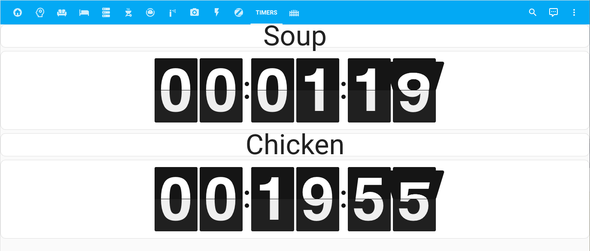

# Echo Timer Sync App
[](https://github.com/custom-components/hacs)
<br><a href="https://www.buymeacoffee.com/aneisch" target="_blank"></a>

_An app to make visual countdown timers via your Amazon Echo devices_

## Installation

This app is best installed using [HACS](https://github.com/custom-components/hacs), so that you can easily track and download updates. You ***must** also install and configure the [Alexa Media Player](https://github.com/alandtse/alexa_media_player) component in order to load timers from your Amazon Echo devices. 

Alternatively, you can download the `echo-timer-sync` directory from inside the `apps` directory here to your local `apps` directory, then add the configuration to enable the `echo_timer_sync` module.

## How it works

When the `_next_timer` entity is updated by Alexa Media Player after setting a timer on your Amazon Echo device, this app creates timers in Home Assistant that you can then put on a dashboard to have a visual similar to what an Echo Show would provide. Corresponding timer labels will be set as well in input_text entities.

## Appdaemon App Configuration

```yaml
Kitchen Timer Sync:
  module: echo_timer_sync
  class: TimerSync
  alexa_timer: sensor.kitchen_next_timer
  timer_prefix: kitchen_alexa
  timer_count: 5
```

## App Prerequisites in Home Assistant

You **must** create `timer` and `input_text` entities in Home Assistant that this app will then populate with your Amazon Echo timer information

```yaml
timer:
  kitchen_alexa_1:
    name: Kitchen Timer 1
    duration: "00:00:00"
    restore: true
  kitchen_alexa_2:
    name: Kitchen Timer 2
    duration: "00:00:00"
    restore: true
  kitchen_alexa_3:
    name: Kitchen Timer 3
    duration: "00:00:00"
    restore: true
  kitchen_alexa_4:
    name: Kitchen Timer 4
    duration: "00:00:00"
    restore: true
  kitchen_alexa_5:
    name: Kitchen Timer 5
    duration: "00:00:00"
    restore: true

input_text:
  kitchen_alexa_1_name:
    name: Kitchen Timer 1 Name
  kitchen_alexa_2_name:
    name: Kitchen Timer 2 Name
  kitchen_alexa_3_name:
    name: Kitchen Timer 3 Name
  kitchen_alexa_4_name:
    name: Kitchen Timer 4 Name
  kitchen_alexa_5_name:
    name: Kitchen Timer 5 Name

```


key | optional | type | default | description
-- | -- | -- | -- | --
`module` | False | string | | The module name of the app.
`class` | False | string | | The name of the Class.
`alexa_timer` | False | string | | The entity_id(s) This is the entity from Alexa Media Player that holds timers
`timer_prefix` | False | string | |This is the prefix to the timer entities you created in HA (see above)
`timer_count` | True | integer | 1 | This corresponds to the number of timer entities you created in HA 


## Issues/Feature Requests

Please feel free to open any issues or feature requests!

  
